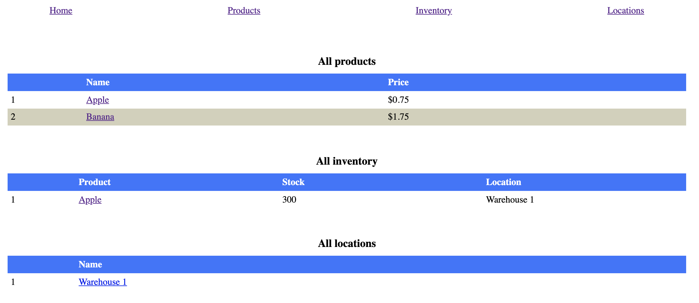
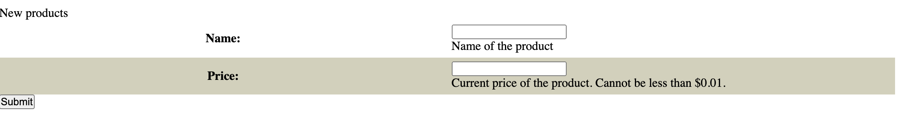
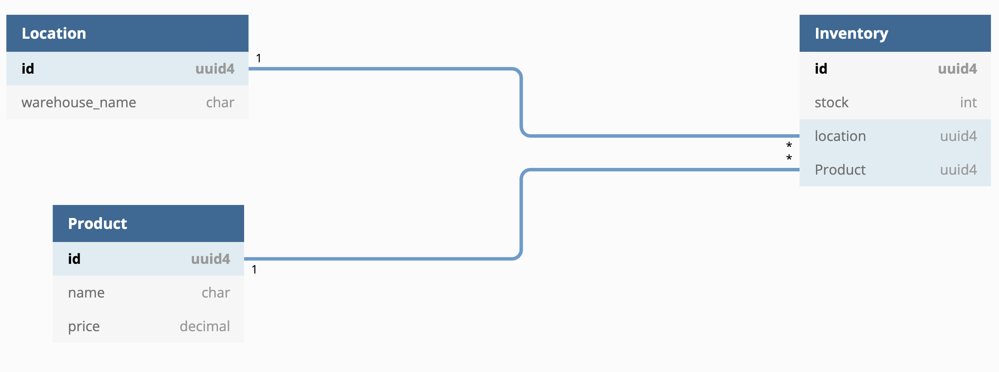

# Shopify Backend Developer Internship Challenge

This is an inventory management web application with CRUD functionality. The application also features the ability to add locations and assign inventory to them.

While designing this app, I tried to keep the scope focused on the main asks for the assignment. A few of the features that I'd like to have included but were outside of the scope of this project are included in last section of the readme.

## How to run

1. Ensure that you have Python 3.7+ installed by running the following in a terminal/command prompt
    
    `$ python3 --version`
- If your version is less than 3.7 or if the command is not recognized, please go to https://www.python.org/downloads/ and follow the setup instructions there to install the latest release of Python for your particular OS. 

2. Clone this repo by running

    `$ git clone https://github.com/GranolaDaniel/Shopify-Backend-Developer-Intern-Challenge.git`
3. Create a virtual environment by running

    `$ python3 -m venv env`
4. Start the virtual environment by running one of the following commands (depending on your OS)

    `$ source env/bin/activate` on Unix/macOS

    `env\Scripts\activate.bat` on Windows
5. Install the dependencies listed in `requirements.txt` by running

    `$ pip3 install -r requirements.txt`

6. Finally, run `$ python3 manage.py runserver` to start the server. Note: the server will be started on port 8000 by default, though the output from the most recent command will indicate if a different port was used.
7. Go to localhost:8000 (or your appropriate port number) in a web browser to view the site.

## Using the application

The home page lists all of the various objects that can be managed in this app. For convenience, I've included a few example items as pictured below.

### Editing/deleting items

To edit or delete any of the items, click on the name of the relevent item, and you'll be taken to the edit page for it. You can then use the form there to change any details, or click the delete link at the bottom of the edit page to remove the item (you'll need to confirm the deletion before any changes are committed).

### Adding new items

If you'd like to add a new item, start by navigating to the corresponding page for the item. For example, if you want to add a new product, click on Products in the top nav bar (or go directly to localhost:8000/products).

You can then click the Add Product link and use the form pictured below to create the new product.

If you'd like to add a product to a specific location, create an inventory item and choose the relevant product and location in the creation form.

## Running Tests

I've included tests for each model and for the ProductForm in the `crud/tests` folder. To start them, run:

`$ python3 manage.py test`

A successful run should output the following:

The model tests verify CRUD functionality for each of the three models, and ensures that the Inventory model follows the expected CASCADE behavior when a linked foreign key instance is deleted (you can read more about that in the architecture section below).

The form test verifies that ProductForms won't be marked as valid if a user tries to enter a price less than 0.1.

## Architecture

I've used [Django's ModelForm class](https://docs.djangoproject.com/en/4.0/topics/forms/modelforms/) to allow users to edit, delete, and add a new instance for each model. The ModelForm class provides a database abstraction layer that I can use to turn user input into SQL statements.

### Model/DB architecture

The Product model has both a name and a price attribute. You can think of a product as the individual item that's being sold/stored. 

The Location model has a name attribute. It's used to define locations where inventory is stored.

Lastly, the Inventory model was added to join individual products with locations. The Inventory model has a stock attribute to track the number of stored products, and a foreign key relationship with both a product and a location.

For the Inventory model, I've set the model to CASCADE on deletion for the Product foreign key, since an inventory item can't exist without an associated product. I've set the deletion behavior for its location foreign key to SET_NULL though, since inventory can still exist without an associated location.

## Possible future additions

- Ability to add a new foreign key-related item while in another object's form. I.e. add a new product while selecting a product from the dropdown in the inventory form.
- Address field for the Location model so users can look up where the location is physically located.
- Sub-location model for dividing up spaces inside locations. I.e. Place inventory on a specific shelf in a warehouse.
- Ability to delete objects in bulk
- Warning for deletions that cause CASCADE behavior. I.e. deleting a product which in turn removes all associated inventory should alert the user first.
- Paginate the lists that show items. Currently all items are fetched from the DB at once, which would result in long load times as the number of rows increases. 